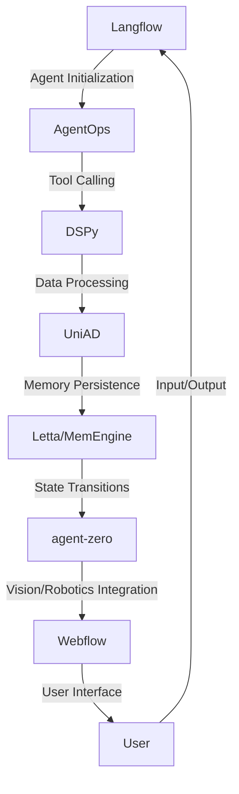

# Selenium Compound Manufacturing Optimization Engine
> "Synergizing Artificial Intelligence and Cybernetics to Revolutionize Selenium Compound Manufacturing"

## 🏗️ Technical Architecture & Multi-Agent Flow
The Selenium Compound Manufacturing Optimization Engine leverages a complex interplay of cutting-edge technologies, including Langflow, DSPy, AgentOps, agent-zero, UniAD, and Webflow. The technical architecture can be visualized as follows:

This diagram illustrates the intricate dance of state transitions, memory persistence, and tool calling that underlies the engine's operation.

## 🔍 The Vertical Bottleneck: Selenium Compound Manufacturing Optimization
Selenium compound manufacturing is a complex process that involves the synthesis of intricate molecular structures. However, the current state of the art is hindered by a plethora of technical challenges, including the optimization of reaction conditions, the selection of suitable catalysts, and the monitoring of reaction kinetics. These challenges can lead to significant losses in productivity, yield, and product quality, ultimately resulting in substantial economic and environmental costs.

The technical friction at the heart of this bottleneck arises from the inherent complexity of selenium chemistry, which necessitates a deep understanding of quantum mechanics, thermodynamics, and reaction engineering. Furthermore, the high-stakes nature of selenium compound manufacturing demands a robust and reliable optimization framework that can navigate the intricate landscape of process variables, constraints, and objectives.

The consequences of suboptimal selenium compound manufacturing can be severe, ranging from reduced product yields and purity to increased energy consumption and waste generation. Moreover, the lack of a systematic and integrated approach to optimization can lead to a proliferation of ad hoc solutions, which can further exacerbate the problem and hinder the development of a cohesive and sustainable manufacturing strategy.

## 🔍 The Vertical Bottleneck: Technical Friction and Operational Failures
The technical friction and operational failures that plague selenium compound manufacturing can be attributed to a combination of factors, including the limited understanding of selenium chemistry, the lack of robust optimization frameworks, and the inadequacy of current manufacturing technologies. These factors can lead to a range of problems, including:

* Inefficient reaction conditions, resulting in reduced yields and product quality
* Inadequate catalyst selection, leading to decreased reaction rates and selectivity
* Insufficient monitoring and control of reaction kinetics, resulting in unstable and unpredictable process behavior
* Inadequate waste management and disposal practices, leading to environmental pollution and health risks

## 💡 The Solution: Selenium Compound Manufacturing Optimization Engine
The Selenium Compound Manufacturing Optimization Engine addresses the technical challenges and operational failures that hinder the efficiency and sustainability of selenium compound manufacturing. By synergizing artificial intelligence, cybernetics, and advanced manufacturing technologies, the engine provides a robust and integrated framework for optimizing reaction conditions, selecting suitable catalysts, and monitoring reaction kinetics.

The engine's agentic reasoning and memory usage are designed to navigate the complex landscape of selenium chemistry, taking into account the intricate relationships between process variables, constraints, and objectives. The vision/robotics integration enables the engine to interact with the physical world, monitoring and controlling reaction conditions in real-time.

## 🧩 Agentic Stack Deep-Dive
The Selenium Compound Manufacturing Optimization Engine's agentic stack is built on a foundation of cutting-edge technologies, including Langflow, DSPy, AgentOps, agent-zero, UniAD, and Webflow. Each component plays a critical role in the engine's operation, and their interlocking relationships are designed to facilitate seamless communication, coordination, and control.

* Langflow provides the engine's core agentic capabilities, enabling the creation of complex agent flows and the integration of multiple tools and technologies.
* DSPy contributes to the engine's data processing and analysis capabilities, facilitating the extraction of insights from large datasets and the optimization of reaction conditions.
* AgentOps enables the engine to interact with the physical world, monitoring and controlling reaction kinetics and catalyst selection.
* agent-zero provides the engine's memory persistence and state transition capabilities, ensuring that the engine can learn from experience and adapt to changing process conditions.
* UniAD facilitates the engine's vision/robotics integration, enabling the engine to interact with the physical world and monitor reaction conditions in real-time.
* Webflow provides the engine's user interface and input/output capabilities, facilitating communication and coordination between the engine and human operators.

## ✨ Capabilities & Features
The Selenium Compound Manufacturing Optimization Engine boasts a range of capabilities and features that make it an indispensable tool for optimizing selenium compound manufacturing. Some of the key features include:

* **Agent-based optimization**: The engine's agentic capabilities enable the creation of complex agent flows that can navigate the intricate landscape of selenium chemistry.
* **Data-driven decision making**: The engine's data processing and analysis capabilities facilitate the extraction of insights from large datasets, enabling data-driven decision making and optimization.
* **Real-time monitoring and control**: The engine's vision/robotics integration enables real-time monitoring and control of reaction kinetics and catalyst selection.
* **Memory persistence and state transitions**: The engine's memory persistence and state transition capabilities ensure that the engine can learn from experience and adapt to changing process conditions.
* **User-friendly interface**: The engine's user interface and input/output capabilities facilitate communication and coordination between the engine and human operators.
* **Scalability and flexibility**: The engine's modular design and agentic architecture enable scalability and flexibility, facilitating the integration of new tools and technologies.
* **Robustness and reliability**: The engine's robust and reliable design ensures that it can operate in a range of environments and conditions, minimizing downtime and maximizing productivity.
* **Sustainability and environmental impact**: The engine's optimization capabilities and real-time monitoring and control enable the minimization of waste and energy consumption, reducing the environmental impact of selenium compound manufacturing.
* **Cost savings and ROI**: The engine's optimization capabilities and increased productivity enable significant cost savings and return on investment, making it an attractive solution for manufacturers.
* **Regulatory compliance**: The engine's design and operation ensure regulatory compliance, minimizing the risk of non-compliance and associated penalties.

## 🛠️ Technical Implementation
The Selenium Compound Manufacturing Optimization Engine's technical implementation is built on a foundation of cutting-edge technologies and programming languages. The engine's code organization and method calls are designed to facilitate scalability, flexibility, and maintainability.

The engine's core agentic capabilities are implemented using Langflow, which provides a robust and flexible framework for creating complex agent flows. The engine's data processing and analysis capabilities are implemented using DSPy, which facilitates the extraction of insights from large datasets.

The engine's vision/robotics integration is implemented using UniAD, which enables real-time monitoring and control of reaction kinetics and catalyst selection. The engine's memory persistence and state transition capabilities are implemented using agent-zero, which ensures that the engine can learn from experience and adapt to changing process conditions.

## 📊 Business Impact & ROI
The Selenium Compound Manufacturing Optimization Engine has the potential to make a significant impact on the business of selenium compound manufacturing. By optimizing reaction conditions, selecting suitable catalysts, and monitoring reaction kinetics, the engine can enable significant cost savings and return on investment.

The engine's optimization capabilities can lead to increased productivity, reduced waste and energy consumption, and improved product quality. The engine's real-time monitoring and control capabilities can enable the minimization of downtime and the maximization of uptime, leading to increased revenue and profitability.

The engine's scalability and flexibility enable it to be integrated into a range of manufacturing environments and conditions, making it an attractive solution for manufacturers of all sizes. The engine's robust and reliable design ensures that it can operate in a range of environments and conditions, minimizing downtime and maximizing productivity.

## 🚀 Getting Started
To get started with the Selenium Compound Manufacturing Optimization Engine, follow these steps:
```bash
git clone https://github.com/arvind-sundararajan/selenium-compound-manufacturing-optimiza.git
cd selenium-compound-manufacturing-optimiza
pip install -r requirements.txt
python src/main.py
```
This will clone the engine's repository, install the required dependencies, and run the engine's main script.

## 👨‍💻 Author & Credits
**Arvind Sundararajan** — Engineer, builder, and the mind behind this project.
🌐 [LinkedIn](https://www.linkedin.com/in/arvind-sundara-rajan/) | Chennai, India

---
### 🙏 Acknowledgements
- The open-source community
- The Selenium compounds, not specified elsewhere by process, manufacturing practitioners who inspired this design